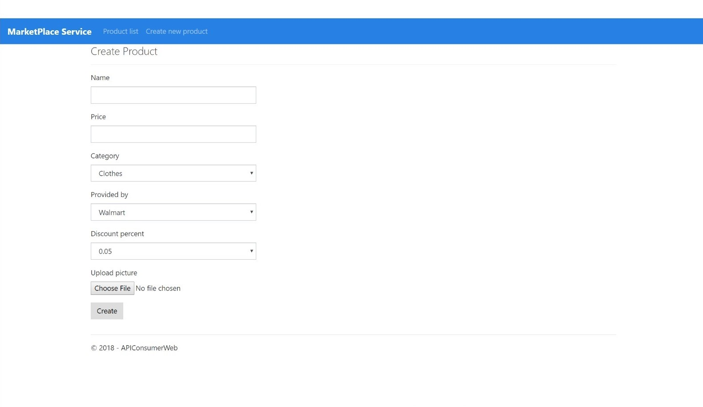

# MarketPlaceServiceAPI

### Purpose of APIs
  *	API offers users to see different offer in-app and find the best suitable deals. Based on this information from different stores, users can also compare the products and finally they decide where to go buy what they want.

### Potential User(s)/Consumer(s)
  *	The store owner, who will post the different deal and offer for a particular product. (store owner will add, update and delete the offer)
  * The user can see the different offers for different stores.
  
### System Architecture

### Swagger API 

### Consumer side web application(Demo)

